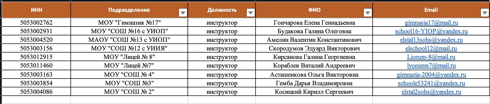

# Утилита для создания учетных записей и назначения проектов.

[_TOC_]


## Принципы использования

1. Утилита установлина на цдаленном сервере и запускается каждые 10 мину.
1. Часть файловый системы сервера монтируется на машину исполнителя.
1. Исполнитель складывает формы с реквезитами в папку `input`.
1. После завершения программы обработанные файлы исчезают из папки `input` и появляются обработанные в папке `output` с суфиксом `processed`.


### Далее преведены скриншоты исходных файлов:




### И пример обработанных файлов и возникших ошибок:


## Установка

### Настройка окружения

```bash
# For Linux/OS X
pip3 install -U pip setuptools

# For Windows
python3 -m pip3 install -U pip setuptools

# For Excel
pip3 install xlrd
pip3 install XlsxWriter
pip3 install openpyxl

# Pandas
pip3 install numpy
pip3 install pandas

# PostgreSQL
pip3 install psycopg2-binary

```


### Изменение настроек

Настройки программы реализованы с помощью редактирования `json` файлов. Файлы находятся в папке `prefs` Далле приведен из список:

* Настройки программы `prefs.json`:

```json
{
  "input_folder": "input/",
  "output_folder": "output/",
  "db_cred_file": "prefs/db_cred.json",
  "messeges_file": "prefs/messeges.json",
  "qwerys_file": "prefs/qwerys.json",
  "debug_mode": true
}
```

* Настройки подключения к БД `db_cred.json`:

```json
{
    "dbname": "***",
    "host": "***.***.***.***",
    "port": "***",
    "user": "***",
    "password": "***"
}
```

* Редактирования сообщений, которые выводит программа в процессе использования и ошибки `messeges.json`;
* Редактирование `SQL` запросов `qwerys.json`;


## Запуск программы

Рекомендуется ставить на хрон скрипт запуска приложения следующего вида:

```bash
$ python3 main.py
```

За выполнением программы подробно протоколируемая, за чем можно следить из консоли.


